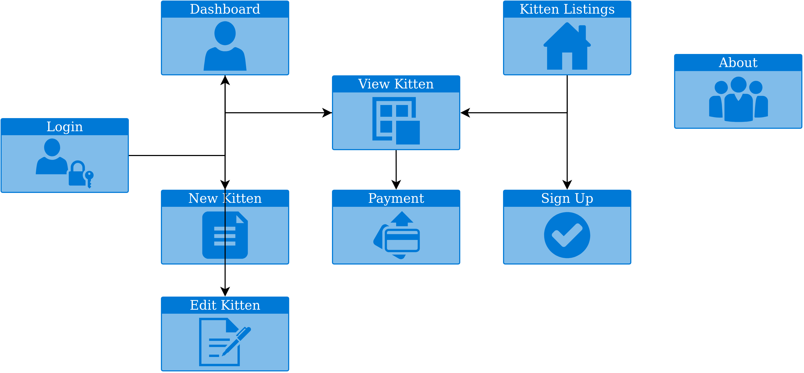
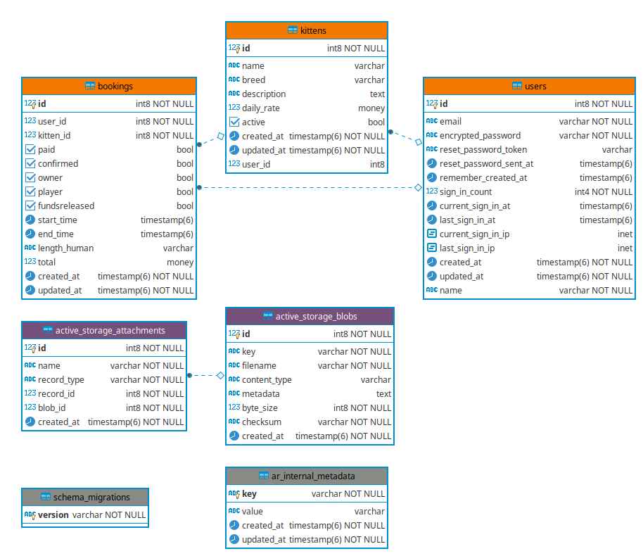
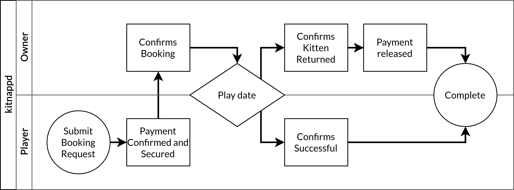

# Ruby on Rails Marketplace Application

I wrote this whilst enrolled at Coder Academy (Melbourne) for my Term 2 assignment, which we were given the guidelines of "must be a 2-way marketplace application, and it must be written in Rails". I came up with the idea of "kitnappd" when I was looking at placeholder image sites, and found placekitten.com. This app allows users to rent their own kittens out to other users, or to rent kittens as needed. The ethics are a little shaky, but thats why its not an actual marketplace. I really enjoyed creating this app though, and I'm happy to have it as part of my portfolio as such.

## My sales pitch

Hi there! Thanks for reading my README. I'm sure you are very excited to be viewing this, and I'm hoping you'll still be thrilled once I've shown you how this app is going to change your life forever.

When I was looking for inspiration for my application, I was struck by a thought that it would be marvellous to be able to have a kitten tea party. You see, I have a pet kitten. He's nearly 4 months old, and gee is he cute. Cute enough that I want more! But sadly I cannot afford more (nor would my boyfriend be particularly thrilled by the idea).

My app - kitnappd (geddit? its a kitten app!) will allow users to loan their kittens to other users in their area for kitten tea party's and other such shenanigans *.

*/*Shenanigans to be defined by the lawyers prior to the app's public launch date.*

---

## Application Details
 * [Purpose](#purpose)
 * [Functionality / features](#functionality)
 * [Sitemap](#sitemap)
 * [Target audience](#target-audience)
 * [Tech stack](#tech-stack)
 * [Entity Relationship Diagram](#erd)
 * [Application Work Flow](#work-flow)
 
---

### [Purpose](#purpose)

This application has been built to allow users an easy way to rent their kittens, or rent kittens that are local to them. I've defined the user roles as "player" (users who rent a kitten) and "owner" (users who rent their kittens to others). Users have free access to both roles, but this definition allows me to differentiate the dual side of the marketplace application.

### [Functionality / features](#functionality)

#### Application features

This app features the listing of all available active kittens, along with the ability for users to login and create their own listings. Users can also rest assured that they are the only ones with access to changing their own data, with the Devise gem being used to add authentication, and authorisation being added into the controllers using "check_user" functions.

Users all also have their own dashboard view, where they are able to update their own details and see their bookings listed, as well as the value of these bookings.

#### Player Functionality

Players can request a booking view the kitten page, which will then take them to a "Payment page", at which point they should submit a payment. If they do not confirm payment at this point a flag appears on the booking request on their dashboard and the kitten page advising that they need to submit payment.

Once the owner confirms that the booking is confirmed the only interaction required from a player is to confirm that the booking was completed successfully, which can be done via the dashboard on the application. After the funds are released to the owner, the player and owner are both able to delete the booking (to avoid cluttering their dashboards).

#### Owner Functionality

Owners are able to list, edit and delete kittens from their accounts. This can all be done via the kitten view. They can also see "pawsed" kittens (those that are recorded without being shown in the active kittens section for bookings).

Owners have to confirm a booking once submitted by a player. This can be done via the dashboard or the kitten listing itself. After the play date, owners only have to confirm that the kitten has been returned in full health, at which point (providing the player has confirmed play date was completed successfully) funds are released to them. After the funds are released to the owner, the player and owner are both able to delete the booking (to avoid cluttering their dashboards).

### [Sitemap](#sitemap)

 <cite>kitnappd Database Diagram</cite>

### [Target audience](#target-audience)

My target audience is kitten lovers everywhere! For those of us who hate it when our kittens grow up into ungrateful cats, who just want those playful daft things that kittens manage to be.

### [Tech stack](#tech-stack)

This application has been deployed using the below tech stack.

| Technology                                                   | Rational / Use                                               |
| ------------------------------------------------------------ | ------------------------------------------------------------ |
| /  | HTML5 documents form the very foundation of what the user interacts with, and CSS3 adds styling, making it easier to read and interact with. |
|                    | Ruby on Rails forms the basis of the web-server, doing the heavy lifting of connecting the HTML5 pages with the database and manipulating responses back to the end user in accordance with this data. |
|                          | I actively used RubyMine in developing this application, and found its many features to be very helpful. As a student I get the Jetbrains IDE for free, and wanted to try it out to see what I was missing. It will be hard to go back to VS Code for Rails applications once I lose access. |
|                        | Boostrap is a really powerful framework for formatting the visuals of an application, providing a lot of the CSS3 gruntwork in simple to use class commands. |
|                                  | My app was built using a Postgresql database, which is compatible with the Heroku platform. |
| / | I deployed my application using Github / Heroku. Once I had setup both, it was easy to auto deploy from Github to Heroku, and it meant all I needed to do was push to Github and then rub `heroku run rails db:migrate` if I had made any database changes. |
|                              | All images that are uploaded in this application are uploaded to a private Amazon S3 bucket, and served from there when needed. |

### [Entity Relationship Diagram](#erd)

 <cite>kitnappd Database Diagram</cite>

### [Application Work Flow](#work-flow)

 <cite>kitnappd Work Flow</cite>

As per the workflow above, users are able to interact with the tasks through the booking cards on their dashboard or on the kitten view page.
