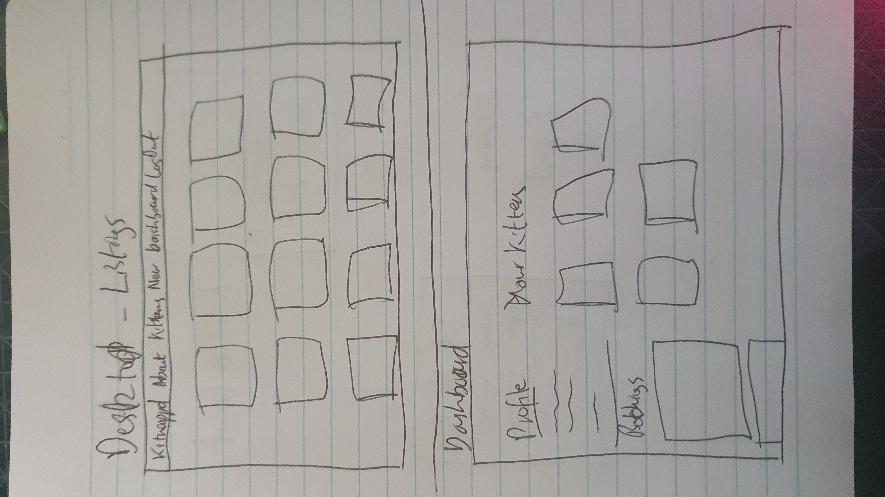

# T2A2 Marketplace Application

[TOC]

---

## R7 - Identification of the _problem_ you are trying to solve by building this particular marketplace _app_.

Hi there! Thanks for reading my README. I'm sure you are very excited to be viewing this, and I'm hoping you'll still be thrilled once I've shown you how this app is going to change your life forever.

When I was looking for inspiration for my application, I was struck by a thought that it would be marvellous to be able to have a kitten tea party. You see, I have a pet kitten. He's nearly 4 months old, and gee is he cute. Cute enough that I want more! But sadly I cannot afford more (nor would my boyfriend be particularly thrilled by the idea).

My app - kitnappd (geddit? its a kitten app!) will allow users to loan their kittens to other users in their area for kitten tea party's and other such shenanigans [[1][1]].

[1]: Shenanigans to be defined by the lawyers prior to the app's public launch date.

---

## R8 - Why is it a _problem_ that needs solving?

I'd like an easy way to increase my kitten ratio per household in the short term, without the 20 year commitment that comes along with owning another cat. That is a problem that definitely needs solving.

---

## R9 - A link (URL) to your deployed _app_ (i.e. website)

[kitnappd](https://kitnappd.herokuapp.com/) - Deployed on Heroku.

---

## R10 - A link to your GitHub repository (repo). _Ensure the repo is accessible by your Educators_

[github.com/miztrz/kitnappd](https://github.com/miztrz/kitnappd)

---

## R11 - Description of your marketplace _app_ (website), including:
 * Purpose
 * Functionality / features
 * Sitemap 
 * Screenshots
 * Target audience 
 * Tech stack (e.g. html, css, deployment platform, etc)

### Purpose

This application has been built to allow users an easy way to rent their kittens, or rent kittens that are local to them. I've defined the user roles as "player" (users who rent a kitten) and "owner" (users who rent their kittens to others). Users have free access to both roles, but this definition allows me to differentiate the dual side of the marketplace application.

### Functionality / Features

#### Application features

This app features the listing of all available active kittens, along with the ability for users to login and create their own listings. Users can also rest assured that they are the only ones with access to changing their own data, with the Devise gem being used to add authentication, and authorisation being added into the controllers using "check_user" functions.

Users all also have their own dashboard view, where they are able to update their own details and see their bookings listed, as well as the value of these bookings.

#### Player Functionality

Players can request a booking view the kitten page, which will then take them to a "Payment page", at which point they should submit a payment. If they do not confirm payment at this point a flag appears on the booking request on their dashboard and the kitten page advising that they need to submit payment.

Once the owner confirms that the booking is confirmed the only interaction required from a player is to confirm that the booking was completed successfully, which can be done via the dashboard on the application. After the funds are released to the owner, the player and owner are both able to delete the booking (to avoid cluttering their dashboards).

#### Owner Functionality

Owners are able to list, edit and delete kittens from their accounts. This can all be done via the kitten view. They can also see "pawsed" kittens (those that are recorded without being shown in the active kittens section for bookings).

Owners have to confirm a booking once submitted by a player. This can be done via the dashboard or the kitten listing itself. After the play date, owners only have to confirm that the kitten has been returned in full health, at which point (providing the player has confirmed play date was completed successfully) funds are released to them. After the funds are released to the owner, the player and owner are both able to delete the booking (to avoid cluttering their dashboards).

### Sitemap

<div style="text-align:center;background-color:lightgrey;border:5px solid lightgrey;margin:10px">

<br><cite>kitnappd Database Diagram</cite>
</div>

### Screenshots


### Target audience

My target audience is kitten lovers everywhere! For those of us who hate it when our kittens grow up into ungrateful cats, who just want those playful daft things that kittens manage to be.

### Tech stack

This application has been deployed using the below tech stack.

| Technology                                                   | Rational / Use                                               |
| ------------------------------------------------------------ | ------------------------------------------------------------ |
| /  | HTML5 documents form the very foundation of what the user interacts with, and CSS3 adds styling, making it easier to read and interact with. |
|                    | Ruby on Rails forms the basis of the web-server, doing the heavy lifting of connecting the HTML5 pages with the database and manipulating responses back to the end user in accordance with this data. |
|                          | I actively used RubyMine in developing this application, and found its many features to be very helpful. As a student I get the Jetbrains IDE for free, and wanted to try it out to see what I was missing. It will be hard to go back to VS Code for Rails applications once I lose access. |
|                        | Boostrap is a really powerful framework for formatting the visuals of an application, providing a lot of the CSS3 gruntwork in simple to use class commands. |
|                                  | My app was built using a Postgresql database, which is compatible with the Heroku platform. |
| / | I deployed my application using Github / Heroku. Once I had setup both, it was easy to auto deploy from Github to Heroku, and it meant all I needed to do was push to Github and then rub `heroku run rails db:migrate` if I had made any database changes. |
|                              | All images that are uploaded in this application are uploaded to a private Amazon S3 bucket, and served from there when needed. |

---

## R12 - User stories for your _app_

Users should be able to:

* Log in and see their active play dates in an easy to read format
* View kitten listings from their mobile phone
* Add new kittens, edit existing kittens and delete ones who have grown up into cats
* Request bookings, and submit payments through this app
* Update their own details at any time

---

## R13 - Wireframes for your _app_




---

## R14 - An ERD for your _app_

<div style="text-align:center;background-color:lightgrey;border:5px solid lightgrey;margin:10px">

<br><cite>kitnappd Database Diagram</cite>
</div>
---

## R15 - Explain the different high-level components (abstractions) in your _app_

At a high level the app is made up from kitten listings (kitten cards) which are also used to view the kittens on the users dashboards. This alllows users to view the kittens show page, where they can further interact with the kitten listings.

I also have kitten booking cards, which appear on the users dashboards as well as the kitten pages, allowing users to see where at any point in time their bookings are, and to update accordingly.

---

## R16 - Detail any third party services that your _app_ will use

My app uses Amazon S3 for image storage, Github for remote code repository, and is deployed onto the internet using Heroku.

---

## R17 - Describe your projects _models_ in terms of the relationships (active record associations) they have with each other

There are 3 main models - the kitten model (which is a very simple model, mostly consisting of the normal CRUD application requirements), and the bookings model (a somewhat more complex model, allowing bookings to be modified by both the players and the owners). The users model controls authentication and authorisation.

---

## R18 - Discuss the database relations to be implemented in your application

Both the Kittens table and the Bookings table have foreign keys to the user table, allowing the users to own either a booking or a kitten. Through the kittens table, owners are able to modify bookings as allowed so that the workflow proceeds as needed.

---

## R19 - Provide your database schema design

```ruby
ActiveRecord::Schema.define(version: 2020_03_11_125846) do

  # These are extensions that must be enabled in order to support this database
  enable_extension "plpgsql"

  create_table "active_storage_attachments", force: :cascade do |t|
    t.string "name", null: false
    t.string "record_type", null: false
    t.bigint "record_id", null: false
    t.bigint "blob_id", null: false
    t.datetime "created_at", null: false
    t.index ["blob_id"], name: "index_active_storage_attachments_on_blob_id"
    t.index %w(record_type record_id name blob_id), name: "index_active_storage_attachments_uniqueness", unique: true
  end

  create_table "active_storage_blobs", force: :cascade do |t|
    t.string "key", null: false
    t.string "filename", null: false
    t.string "content_type"
    t.text "metadata"
    t.bigint "byte_size", null: false
    t.string "checksum", null: false
    t.datetime "created_at", null: false
    t.index ["key"], name: "index_active_storage_blobs_on_key", unique: true
  end

  create_table "bookings", force: :cascade do |t|
    t.bigint "user_id", null: false
    t.bigint "kitten_id", null: false
    t.boolean "paid", default: false
    t.boolean "confirmed", default: false
    t.boolean "owner", default: false
    t.boolean "player", default: false
    t.boolean "fundsreleased", default: false
    t.datetime "start_time"
    t.datetime "end_time"
    t.string "length_human"
    t.money "total", scale: 2
    t.datetime "created_at", precision: 6, null: false
    t.datetime "updated_at", precision: 6, null: false
    t.index ["kitten_id"], name: "index_bookings_on_kitten_id"
    t.index ["user_id"], name: "index_bookings_on_user_id"
  end

  create_table "kittens", force: :cascade do |t|
    t.bigint "user_id"
    t.string "name"
    t.string "breed"
    t.text "description"
    t.money "daily_rate", scale: 2
    t.boolean "active", default: true
    t.datetime "created_at", precision: 6, null: false
    t.datetime "updated_at", precision: 6, null: false
    t.index ["user_id"], name: "index_kittens_on_user_id"
  end

  create_table "users", force: :cascade do |t|
    t.string "name", default: "", null: false
    t.string "email", default: "", null: false
    t.string "encrypted_password", default: "", null: false
    t.string "reset_password_token"
    t.datetime "reset_password_sent_at"
    t.datetime "remember_created_at"
    t.integer "sign_in_count", default: 0, null: false
    t.datetime "current_sign_in_at"
    t.datetime "last_sign_in_at"
    t.inet "current_sign_in_ip"
    t.inet "last_sign_in_ip"
    t.datetime "created_at", precision: 6, null: false
    t.datetime "updated_at", precision: 6, null: false
    t.index ["email"], name: "index_users_on_email", unique: true
    t.index ["reset_password_token"], name: "index_users_on_reset_password_token", unique: true
  end

  add_foreign_key "active_storage_attachments", "active_storage_blobs", column: "blob_id"
  add_foreign_key "bookings", "kittens"
  add_foreign_key "bookings", "users"
  add_foreign_key "kittens", "users"
end

puts "Schema loaded successfully, please run 'rails db:seed' to fill with temp data."
```

---

## R20 - Describe the way tasks are allocated and tracked in your project


As per the workflow above, users are able to interact with the tasks through the booking cards on their dashboard or on the kitten view page.